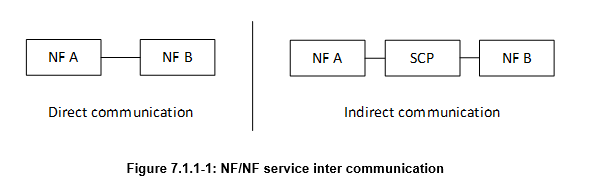
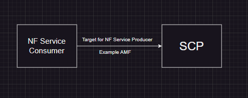
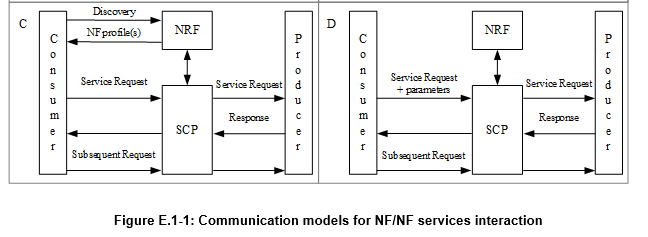

# SCP (Service Communication Protocol) DEV

Este documento proporciona pautas para desarrolladores que trabajan en el proyecto SCP (Service Communication Protocol).

Esta información fue extraída de la arquitectura 5GS según 3GPP TS 23501-j20.

## Instruction

El Service Communication Protocol (SCP) incluye una o más de las siguientes funcionalidades. Algunas o todas las funcionalidades del SCP pueden ser soportadas en una sola instancia de SCP:

- Indirect Communication.
- Delegated Discovery.
- Message forwarding and routing to destination NF/NF service.
- Message forwarding and routing to a next hop SCP.
- Communication security (e.g. authorization of the NF Service Consumer to access the NF Service Producer API), load balancing, monitoring, overload control, etc.
- Optionally interact with UDR, to resolve the UDM Group ID/UDR Group ID/AUSF Group ID/PCF Group ID/CHF Group ID/HSS Group ID based on UE identity, e.g. SUPI or IMPI/IMPU.
- Optionally interact with NF and NWDAF, to support network abnormal behaviours (i.e. signalling storm) mitigation and prevention.
- Optionally expose events related to service-agnostic characteristics of messages the SCP passes such as Load, Delay, Error rate, number of messages.

Ahora describiremos estas funcionalidades con más detalle:

## Functionalities

Los servicios NF pueden comunicarse directamente entre consumidores y productores de servicios NF, o indirectamente a través de un SCP. La Comunicación Directa e Indirecta se ilustra en la Figura 7.1.1-1.

En la Comunicación Indirecta, el consumidor de servicios NF se comunica con el productor de servicios NF objetivo a través de un SCP. El consumidor de servicios NF puede estar configurado para realizar el descubrimiento del productor de servicios NF objetivo directamente, o delegar el descubrimiento al SCP utilizado para la Comunicación Indirecta. En este último caso, el SCP utiliza los parámetros proporcionados por el consumidor de servicios NF para realizar el descubrimiento y/o la selección del productor de servicios NF objetivo. La dirección del SCP puede estar configurada localmente en el consumidor de servicios NF. Véase la siguiente imagen.

La detección de funciones de red (NF discovery) y la detección de servicios de funciones de red (NF service discovery) permiten que las entidades de la red central (Funciones de Red o NF, o el Proxy de Comunicación de Servicio, SCP) descubran un conjunto de instancias de NF y/o instancias de servicios de NF para un servicio de NF o un tipo de NF específico. La detección de servicios de NF se habilita a través del procedimiento de detección de NF, tal como se especifica en las cláusulas 4.17.4, 4.17.5, 4.17.9 y 4.17.10 de la especificación técnica TS 23.502.

A menos que la información esperada de la NF y del servicio de NF esté configurada localmente en la NF solicitante (por ejemplo, cuando el servicio de NF o la NF esperada están en la misma PLMN -Red Pública Terrestre Móvil- que la NF solicitante), la detección de NF y servicios de NF se implementa a través de la Función de Repositorio de Red (NRF). La NRF es la función lógica que se utiliza para soportar la funcionalidad de detección de NF y servicios de NF, y la notificación de estado.

NOTA 1: La NRF puede estar ubicada junto con el SCP, por ejemplo, para la opción de comunicación D, representada en el Anexo E.

Veamos la siguiente tabla que se muestra a continuación.

| Communication between consumer and producer | Service discovery and request routing                                                                 | Communication model |
|---------------------------------------------|--------------------------------------------------------------------------------------------------------|---------------------|
| Direct communication                        | No NRF or SCP; direct routing                                                                          | A                   |
| Direct communication                        | Discovery using NRF services; no SCP; direct routing                                                   | B                   |
| Indirect communication                      | Discovery using NRF services; selection for specific instance from the Set can be delegated to SCP. Routing via SCP | C                   |
| Indirect communication                      | Discovery and associated selection delegated to an SCP using discovery and selection parameters in service request; routing via SCP | D                   |

Vamos a centrarnos en los modelos C y D, que son los más relevantes para el SCP, en nuestro caso que estamos desarrollando un Core a partir de Aether.

Modelo C - Comunicación indirecta sin descubrimiento delegado: Los consumidores realizan el descubrimiento consultando el NRF. Basándose en el resultado del descubrimiento, el consumidor selecciona un conjunto de NF o una instancia específica de NF dentro del conjunto. El consumidor envía la solicitud al SCP, incluyendo la dirección del productor de servicios seleccionado, que apunta a una instancia de servicio NF o a un conjunto de instancias de servicio NF. En este último caso, el SCP selecciona una instancia de servicio NF. Si es posible, el SCP interactúa con el NRF para obtener parámetros de selección como ubicación, capacidad, etc. El SCP enruta la solicitud a la instancia de productor de servicio NF seleccionada.

Modelo D - Comunicación indirecta con descubrimiento delegado: Los consumidores no realizan ningún descubrimiento ni selección. El consumidor añade los parámetros necesarios de descubrimiento y selección requeridos para encontrar un productor adecuado en la solicitud de servicio. El SCP utiliza la dirección de la solicitud y los parámetros de descubrimiento y selección incluidos en el mensaje de solicitud para enrutar la solicitud a una instancia de productor adecuada. El SCP puede realizar el descubrimiento con un NRF y obtener el resultado correspondiente.

Para que la NF solicitante o el SCP obtengan información sobre la NF y/o los servicios de NF registrados o configurados en una PLMN/slice, basándose en la configuración local, la NF solicitante o el SCP pueden iniciar un procedimiento de detección con la NRF. Esto se hace proporcionando el tipo de la NF y, opcionalmente, una lista de los servicios específicos que intenta descubrir. La NF solicitante o el SCP también pueden proporcionar otros parámetros de servicio, como información relacionada con la segmentación (slicing). Para los parámetros de servicio detallados utilizados para la detección específica de NF y servicios de NF, consulta la cláusula 5.2.7.3.2 de la TS 23.502. La NF solicitante también puede proporcionar información relacionada con el Conjunto de NF para permitir la reselección de instancias de NF dentro de un conjunto de NF. La NF solicitante también puede proporcionar las características soportadas requeridas de la NF.

Para algunas Funciones de Red que tienen acceso a los datos de suscripción (por ejemplo, HSS, UDM), la NRF puede necesitar resolver el ID de Grupo de NF correspondiente a un identificador de suscriptor. Si la NRF no tiene una configuración almacenada localmente que mapee conjuntos/rangos de identidades a ID de Grupo de NF, la NRF puede recuperar el ID de Grupo de NF correspondiente a un identificador de suscriptor específico del UDR utilizando la operación de servicio Nudr_GroupIDmap_Query.

En el caso de la Comunicación Indirecta, un Consumidor de Servicios de NF emplea un SCP que enruta la solicitud al destino previsto de la solicitud.

Si la NF solicitante está configurada para delegar la detección, la NF solicitante puede omitir el procedimiento de detección con la NRF y, en su lugar, delegar la detección al SCP; el SCP actuará entonces en nombre de la NF solicitante. En este caso, la NF solicitante añade cualquier parámetro de detección y selección necesario a la solicitud para que el SCP pueda realizar la detección y la selección asociada. El SCP puede interactuar con la NRF para realizar la detección y obtener el resultado de la detección, y puede interactuar con la NRF o el UDR para obtener el ID de Grupo de NF correspondiente al identificador de suscriptor.

Para la detección delegada (delegated discovery) del HSS (Home Subscriber Server) o del UDM (Unified Data Management), el SCP puede depender de la NRF (Network Repository Function) para descubrir el grupo de instancias de HSS/UDM que sirven a la identidad de usuario proporcionada. Alternativamente, en algunas implementaciones, el SCP puede consultar primero al UDR (User Data Repository) para obtener el ID de Grupo de HSS/UDM correspondiente a la identidad de usuario proporcionada. Se espera que la etapa 3 (de estandarización) defina una codificación única para la identidad de usuario proporcionada por el consumidor de servicios. Esto es para evitar que el consumidor de servicios necesite conocer el comportamiento del SCP, y que pueda usarse para ambas variantes de detección delegada.

La NRF proporciona una lista de instancias de NF y de instancias de servicios de NF relevantes según los criterios de detección. La NRF puede proporcionar la dirección IP o el FQDN (Fully Qualified Domain Name) de las instancias de NF y/o las Direcciones de Endpoint de las instancias de servicios de NF relevantes al Consumidor de NF o al SCP. La NRF también puede proporcionar el NF Set ID y/o el NF Service Set ID al Consumidor de NF o al SCP. La respuesta contiene un período de validez durante el cual el resultado de la detección se considera válido y puede ser almacenado en caché (cached). El resultado del procedimiento de detección de NF y servicios de NF es aplicable a cualquier suscriptor que cumpla los mismos criterios de detección. La entidad que realiza la detección puede almacenar en caché el/los perfil/es de NF recibidos del procedimiento de detección de NF/servicios de NF. Durante el período de validez, el/los perfil/es de NF almacenado/s en caché puede/n usarse para la selección de NF para cualquier suscriptor que coincida con los criterios de detección.

NOTA 3: Consulta la TS 29.510 [58] para detalles sobre el uso del período de validez.

En el caso de la Comunicación Directa, la NF solicitante utiliza el resultado de la detección para seleccionar una instancia de NF y una instancia de servicio de NF que sea capaz de proporcionar un Servicio de NF solicitado (por ejemplo, una instancia de servicio de la PCF que pueda proporcionar Autorización de Política).

En el caso de la Comunicación Indirecta sin Detección Delegada, la NF solicitante utiliza el resultado de la detección para seleccionar una instancia de NF, mientras que la selección de la instancia de servicio de NF asociada puede ser realizada por la NF solicitante y/o por un SCP en nombre de la NF solicitante.

En ambos casos anteriores, la NF solicitante puede usar la información de un resultado de detección válido almacenado en caché para selecciones posteriores (es decir, la NF solicitante no necesita activar un nuevo procedimiento de detección de NF para realizar la selección).

En el caso de la Comunicación Indirecta con Detección Delegada, el SCP descubrirá y seleccionará una instancia de NF adecuada y una instancia de servicio de NF adecuada, basándose en los parámetros de detección y selección proporcionados por la NF solicitante y una interacción opcional con la NRF. La NRF a usar puede ser proporcionada por el consumidor de NF como parte de los parámetros de detección, por ejemplo, como resultado de una consulta a la NSSF (Network Slice Selection Function). El SCP puede usar la información de un resultado de detección válido almacenado en caché para selecciones posteriores (es decir, el SCP no necesita activar un nuevo procedimiento de detección de NF para realizar la selección).

NOTA 4: En una PLMN (Red Pública Terrestre Móvil) dada, puede aplicarse la Comunicación Directa, la Comunicación Indirecta o ambas.

La NF solicitante o el SCP pueden suscribirse para recibir notificaciones de la NRF sobre un perfil de NF recién actualizado (por ejemplo, instancias de servicios de NF que entran o salen de servicio), o instancias de NF recién registradas o dadas de baja. El procedimiento de suscripción/notificación del estado de NF/servicios de NF se define en las cláusulas 4.17.7 y 4.17.8 de la TS 23.502 [3].

Para la detección de NF y servicios de NF entre PLMNs (redes interconectadas), la NRF en la PLMN local interactúa con la NRF en la PLMN remota para recuperar el/los perfil/es de NF de la/s instancia/s de NF en la PLMN remota que coinciden con los criterios de detección. Si la NRF en la PLMN local indicó soporte, para la PLMN local, de comunicación indirecta con detección delegada con (re)selección de NF en la PLMN de destino (Modelo D en el Anexo E con SCP en la PLMN de destino realizando la (re)selección de NF) y/o de comunicación indirecta sin detección delegada con (re)selección de NF en la PLMN de destino (Modelo C en el Anexo E con SCP en la PLMN de destino realizando la (re)selección de NF), basándose en la política del operador y las capacidades de la PLMN local, la NRF en la PLMN remota también puede devolver una indicación de que se solicita la comunicación indirecta con detección delegada con (re)selección de NF en la PLMN de destino o que se solicita la comunicación indirecta sin detección delegada con (re)selección de NF en la PLMN de destino y, para la detección delegada en la PLMN de destino, omitir los perfiles de NF. La NRF en la PLMN local llega a la NRF en la PLMN remota formando una consulta específica de la PLMN remota utilizando el ID de PLMN proporcionado por la NF solicitante. La NRF remota puede interactuar además con una NRF de la PLMN de destino según lo especificado en la cláusula 6.2.6.1. Basándose en la política y configuración del operador, la NRF en la PLMN local también puede determinar, sin interacción con la NRF en la PLMN remota, que se solicita la comunicación indirecta con detección delegada con (re)selección de NF en la PLMN de destino para la comunicación con esa PLMN remota. El procedimiento de detección de NF/servicios de NF entre PLMNs se especifica en las cláusulas 4.17.5, 4.17.10 y 4.17.10a de la TS 23.502 [3].

NOTA 5: Consulta la TS 29.510 [58] para detalles sobre el uso de la consulta específica del ID de PLMN de destino para llegar a la NRF en la PLMN remota.
NOTA 6: La NRF en la PLMN local puede interactuar con las NRFs en las PLMNs de destino incluso antes de recibir solicitudes de detección relacionadas para consultar el soporte de comunicación indirecta por parte de esas PLMNs de destino, almacenar la información recibida en caché y usarla para solicitudes de detección posteriores.

Para ocultación de topología, consulta la cláusula 6.2.17.

La NRF puede tomar las medidas adecuadas al detectar ciertos eventos locales, por ejemplo, carga de NF que el uso de recursos de NF es anormal, o de notificación de suscripción a análisis de tormentas de señalización para predecir tormentas de señalización de la NWDAF (Network Data Analytics Function).

Un concepto importante es el binding

Imagina que en una red 5G hay muchísimas funciones de red (NFs) que necesitan hablar entre sí constantemente. Para que esta comunicación sea eficiente, coherente y rápida, existe un concepto clave llamado **"Binding" (Vinculación)**.

El Binding es como darle a una NF un "recordatorio" o una "pista" para que siempre sepa con qué otra NF específica debe hablar en el futuro, especialmente cuando se trata de un tema o "contexto" particular (por ejemplo, una llamada de un usuario o una sesión de datos específica).

---

### **1. ¿Para qué sirve el Binding?**

En esencia, el Binding tiene dos grandes propósitos:

* **Para los "Productores de Servicios" (NFs que ofrecen algo):** Una NF que ofrece un servicio (por ejemplo, la que gestiona tu sesión de internet) puede decirle a la NF que consume ese servicio (por ejemplo, la que gestiona tu conexión al móvil): "Para este usuario o esta sesión en particular, por favor, sigue viniendo siempre a mí (o a este grupo de NFs)". Esto ayuda a mantener la coherencia y el rendimiento.
* **Para los "Consumidores de Servicios" (NFs que piden algo):** Una NF que consume un servicio (por ejemplo, la que necesita recibir notificaciones) puede decirle a la NF que le envía las notificaciones: "Para esta suscripción de notificación, envíame los mensajes a esta instancia mía". También sirve para indicar dónde puede responderle el productor si el consumidor ofrece sus propios servicios dentro del mismo contexto.

---

### **2. ¿Cómo funciona? La "Binding Indication" y "Routing Binding Indication"**

La información de "Binding" se transmite mediante dos tipos de "indicaciones":

* **Binding Indication (BI):**
    * Es la **información principal** que dice con qué NF (o grupo de NFs) hay que "vincularse".
    * Contiene identificadores como el ID de la instancia de NF, el ID del servicio de NF, o el ID de conjuntos de NFs/servicios.
    * **Lo envía el productor** al consumidor para futuras solicitudes, o **lo envía el consumidor** al productor para que sepa dónde enviar notificaciones o solicitudes de vuelta.
    * Si un recurso se crea en la NF productora, esta también puede incluir su dirección de destino (endpoint) en el BI.

* **Routing Binding Indication (RBI):**
    * Es una **copia exacta del Binding Indication**, pero tiene un propósito muy específico: **guiar al SCP (Service Communication Proxy)** cuando se usa la comunicación indirecta.
    * Se incluye en los mensajes de solicitud, suscripción o notificación que pasan por el **SCP**.
    * Si, por alguna razón, el destino inicial de un mensaje no funciona (por ejemplo, una NF se cae), el **SCP** puede usar el **RBI** para encontrar una alternativa adecuada en la NRF (el "directorio" de la red) y re-enviar el mensaje, manteniendo la "vinculación" establecida.

---

### **3. Casos clave de uso y otros detalles:**

* **Persistencia y Caché:** Cuando una NF obtiene una "Binding Indication", puede guardarla en su caché por un tiempo determinado (un "período de validez"). Esto evita tener que preguntar a la NRF cada vez, haciendo la comunicación más rápida y eficiente.
* **Delegación al SCP:** En la comunicación indirecta (donde el SCP actúa como intermediario), el consumidor simplemente envía el Binding Indication al SCP, y el SCP se encarga de usarlo para enrutar el mensaje correctamente y, si es necesario, encontrar un destino alternativo.
* **Notificaciones:** El Binding es muy importante para las notificaciones. El NF que espera la notificación (el consumidor) le dice al NF que la envía (el productor) a dónde debe enviarla. Si esa dirección falla, el productor puede usar la información del Binding para intentar encontrar otro destino válido en la NRF para la notificación.
* **Combinación de Binding Indications:** Para ahorrar recursos, si el Binding es a nivel de un conjunto de NFs o una instancia de NF, las indicaciones para notificaciones y para otros servicios pueden combinarse si se refieren al mismo servicio.
* **Grupos de Recursos:** Se pueden vincular grupos enteros de recursos (contextos) con un solo "Binding Indication", lo que simplifica la gestión cuando un grupo de tareas o usuarios necesita ser manejado por una NF diferente.

---

### **En resumen:**

El **Binding** es un mecanismo inteligente en 5G para que las NFs puedan recordar y guiar la comunicación hacia las instancias de NF correctas para un contexto particular. La **Binding Indication** lleva la "pista" de la vinculación, y el **Routing Binding Indication** es esa misma pista para que el **SCP** enrute los mensajes. Esto asegura que la red sea eficiente, coherente y pueda recuperarse si una NF falla, manteniendo siempre la mejor conexión para cada tarea.

Cuando las Funciones de Red (NFs) se comunican de forma indirecta (es decir, a través de un intermediario como el SCP), el Service Communication Proxy (SCP) asume responsabilidades importantes en cómo se encuentran y eligen los servicios y las NFs.

Prioridad del "Routing Binding Indication" (RBI):

Si un mensaje de solicitud de servicio llega al SCP e incluye un Routing Binding Indication (RBI), el SCP lo usará para enrutar la solicitud directamente al destino que está "vinculado". Este RBI es una pista muy específica que le dice al SCP con qué instancia de NF (o grupo de NFs) debe hablar para ese contexto particular.

Uso del "NF Set ID" si no hay RBI:

Si la solicitud no trae un RBI, el SCP puede intentar obtener un NF Set ID (un identificador de un grupo de NFs) de la NRF (la función de directorio de la red) o de su propia configuración interna. Esto le ayuda a identificar un conjunto de NFs que podrían ofrecer el servicio.

Mantener la Vinculación:

Si una NF que recibe una solicitud (el "destinatario de la solicitud") ya le había enviado previamente un Binding Indication a la NF que ahora envía la solicitud (el "remitente de la solicitud"), entonces el remitente debe incluir ese mismo Binding Indication (como un RBI) en todas las solicitudes relacionadas que envíe después. Esto asegura que la comunicación siga yendo a la misma instancia de NF, manteniendo la coherencia de la sesión o el contexto.

Información de Ubicación
La información de ubicación es un dato importante que describe dónde está físicamente una instancia de NF dentro de la red.

Qué es la Información de Ubicación:

Describe la posición en la red de una instancia específica de una NF (no de un grupo, sino de una sola instancia).

Puede tener varios niveles de detalle, desde la ubicación geográfica hasta el centro de datos o el clúster específico donde se encuentra. Sin embargo, cada instancia de NF solo tiene una ubicación asignada.

Para qué se usa:

Se utiliza para seleccionar una instancia de servicio de NF o una instancia de NF que esté en una ubicación de red particular. Esto se decide en base a la configuración local del operador.

Nota: La granularidad (el nivel de detalle) de la información de ubicación puede variar según cómo el operador despliegue su red.

Todo lo expuesto anteriormente es toeria previa definida en el 3GPP, es bueno estar consiente de como se definen todos estas operaciones para desarrollar un SCP o una NF opeable y mantenible en el tiempo.
