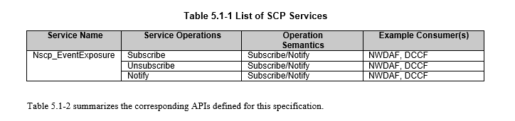

# SCP Service

La referencia para crear este SCP Service es el documento 3GPP 29570-100, que aún se encuentra en borrador. Sin embargo, podemos avanzar en el desarrollo del servicio utilizando la información disponible.

Como se observa, solo se define un servicio: el Nscp_EventExposure Service.

El servicio Nscp_EventExposure permite que el SCP exponga datos de eventos en tiempo real relacionados con la señalización y el rendimiento de la red a otros NFs (por ejemplo, NWDAF y DCCF) para análisis y monitoreo.

En el documento solo se define un solo tipo de evento para el servicio Nscp_EventExposure. Este evento es: SERVICE_SIGNALLING_CHARACTERISTICS.

Un NF se suscribe a este evento para recibir los reportes del SCP sobre la tasa observada (es decir, el número por intervalo de tiempo) de varios tipos de mensajes de señalización recibidos y enviados por diferentes instancias de NF, así como el porcentaje de transacciones fallidas.

El servicio Nscp_EventExposure define tres operaciones de servicio:

- Notificar: El SCP envía notificaciones a los consumidores suscritos, proporcionando datos de eventos e información relacionada.
- Suscribirse: Una función de red (NF) se suscribe para recibir notificaciones de eventos específicos, con la opción de definir parámetros de filtrado o suscripción.
- Cancelar suscripción: Un NF cancela la suscripción a una notificación de evento previamente establecida.

Estas operaciones permiten a los consumidores gestionar la recepción de datos de eventos relacionados con la señalización y el rendimiento de la red (y otros tipos de eventos)

La explicacion de cada una de estas operaciones esta en el documento correspondiente, consultar cada una para su desarrollo.

Lo expuesto anteriormente no es lo importante. Ahora centremosno en como desarrollar estas funcionalidades descritas en otras documentaciones:

- Indirect Communication.
- Delegated Discovery.
- Message forwarding and routing to destination NF/NF service.
- Message forwarding and routing to a next hop SCP.
- Communication security (e.g. authorization of the NF Service Consumer to access the NF Service Producer API), load balancing, monitoring, overload control, etc.

Para explicar como desarrollar este SCP mejor una imagen de ejemplo:

